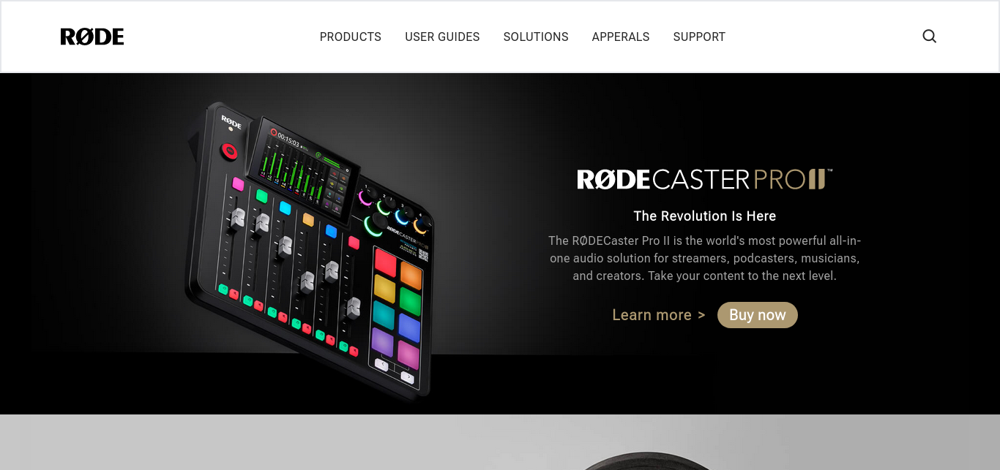
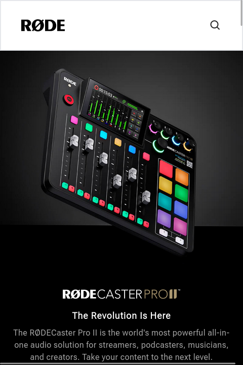

## A fully responsive Rode.com clone

> By Aditya Kadali

## Screenshots:

- Desktop:

  

- Mobile:

  

## Built with:

- Semantic HTML5
- Tailwind CSS

## Key learnings:

- In this project I learned about responsive design.
- Also target images to show on specific screens using tailwind CSS

## Time taken:

- This project took me more than 6 hours to build from scratch

## Links:

- [Live Demo](https://rode-clne.netlify.app/)
- [Source](https://github.com/Adityakadali/rode-website-clone)
